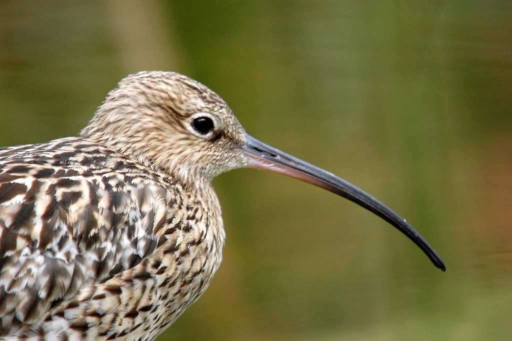

# Curlew

Curlew is a theme for Hugo.

## Installation

### As a Submodule

`$ git submodule add git@github.com:alexanderkatz/curlew.git themes/curlew`

`$ npm install`

## Gulp

Gulp is used to compile the SCSS files.

## Isotope

Is used to create the portfolio masonry grid and filtering.

##Attribution

[Kev Chapman](https://www.flickr.com/photos/25553993@N02/2772592278/) - Wonderful Curlew photograph
